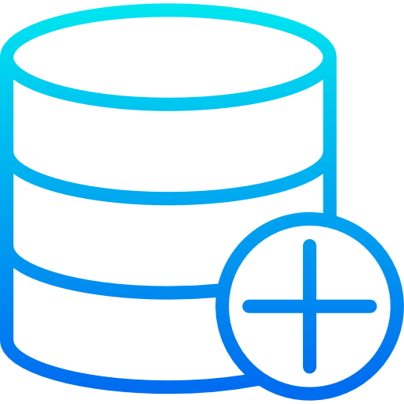
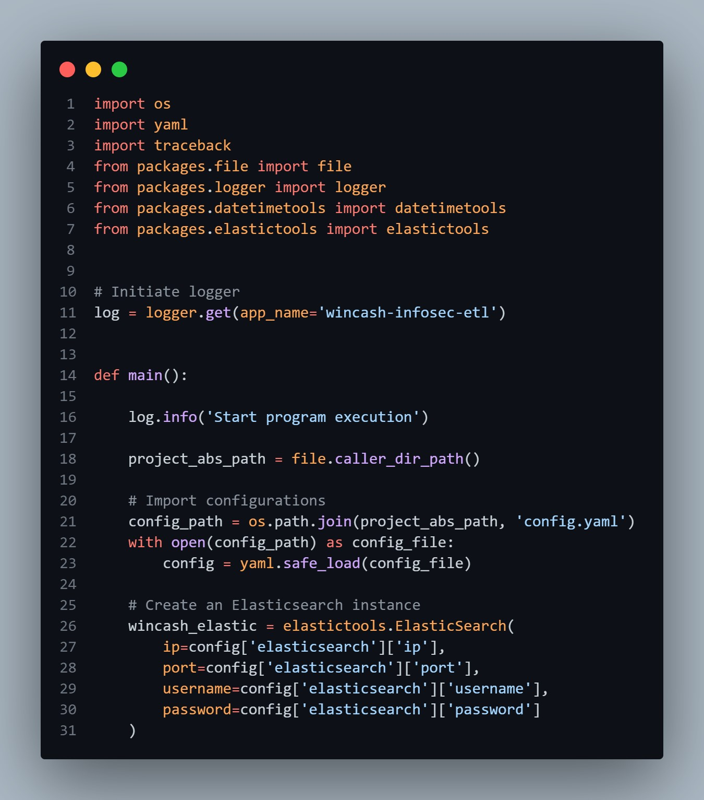

[![LinkedIn][linkedin-shield]][linkedin-url]

<!-- PROJECT LOGO -->
 

    
  <h3 align="center">Wincash Access Monitoring ETL</h3>

<!-- TABLE OF CONTENTS -->

  
Table of Contents

  <ol>
    <li>
      <a href="#about-the-project">About The Project</a>
      <ul>
        <li><a href="#business-case">Business Case</a></li>
        <li><a href="#technical-solution">Technical Solution</a></li>
        <li><a href="#screenshots">Screenshots</a></li> <!-- Only if present -->
        <li><a href="#tech-stack">Tech Stack</a></li>
      </ul>
    </li>
    <li><a href="#contact">Contact</a></li>
  </ol>

<!-- ABOUT THE PROJECT -->
## About The Project

* **Project Name:** Wincash Access Monitoring ETL  
* **Version:** v1.0.0  
* **Department:** Technology

---

### Business Case

The Corporate Security team needed to monitor the access activity of store staff within the Wincash system. To achieve this, they required the access data from Wincash to be extracted and ingested into their Oracle database. 

This ETL process automates the extraction of ~15 million records daily from Elasticsearch and loads them into the Corporate Security team's Oracle database for centralized monitoring and analysis.

(<a href="#readme-top">back to top</a>)

### Technical Solution

The ETL process performs the following:
* Authenticates with Elasticsearch to retrieve Wincash access records.
* Scrolls through Elasticsearch API to handle large datasets (~15 million records daily).
* Loads the extracted records into the Oracle database for consolidation and monitoring.

(<a href="#readme-top">back to top</a>)

### Screenshots

(<a href="#readme-top">back to top</a>)

### Tech Stack

This project was developed using the following tech stack:

* **Python**
* **SQL**

(<a href="#readme-top">back to top</a>)

<!-- CONTACT -->
## Contact

Mohamed AbdelGawad Ibrahim - [@m-abdelgawad](https://www.linkedin.com/in/m-abdelgawad/) - <a href="tel:+201069052620">+201069052620</a>

(<a href="#readme-top">back to top</a>)

<!-- MARKDOWN LINKS & IMAGES -->
[linkedin-shield]: https://img.shields.io/badge/-LinkedIn-black.svg?style=for-the-badge&logo=linkedin&colorB=555
[linkedin-url]: https://www.linkedin.com/in/m-abdelgawad/
